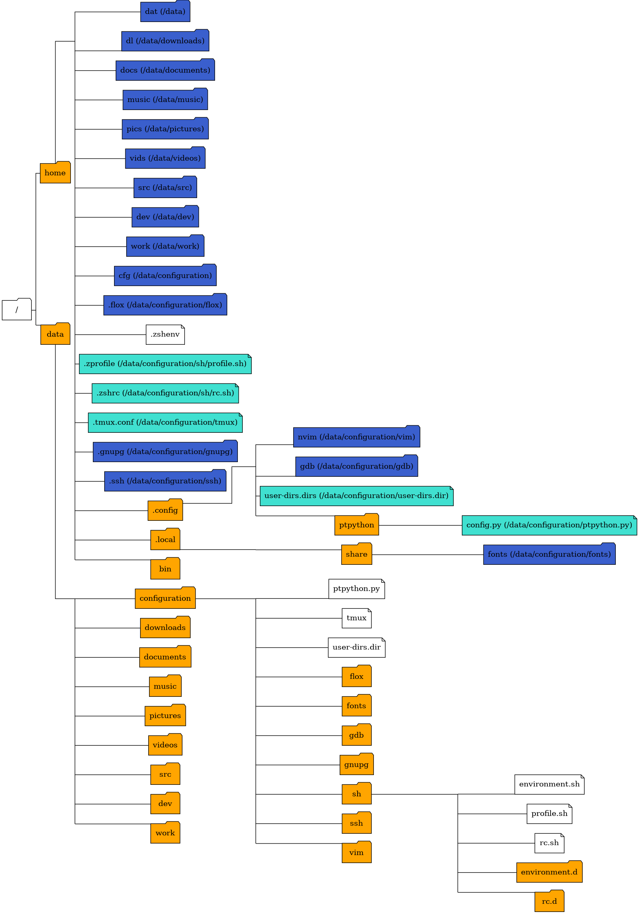

# Configuration Files

My framework for my configuration/dot files.

## Setup

### Setup Environment Variables

| Name | Default | Description |
| --- | --- | --- |
| `install_data` | `/data` | |
| `install_home` | `$HOME` | |
| `install_xdg_config_home` | `$XDG_CONFIG_HOME` or else `$install_home/.config` | |
| `install_xdg_data_home` | `$XDG_DATA_HOME` or else `$install_home/.local/share` | |
| `install_user_dirs` | `true` | Create and link replacements for common home directories in `$install_data` |
| `skip_set_ssh_origin` | `false` | Skip setting SSH origin for git repo |

### Linux Setup

- Install [Flox](https://flox.dev/docs/install-flox/)
- Make sure these programs are installed:
    - Zsh
    - GnuPG
    - git
    - Ex: `sudo apt install zsh gnupg git`
    - Optionally:
        - xclip
        - ptpython
        - ipython
        - Ex: `sudo apt install xclip ptpython ipython`
- Create a `/data` directory (or whatever `$install_data` is)
    - `sudo mkdir /data`
    - `sudo chown $USER:$USER /data`
- Place/clone this repository at `/data/configuration`.
    - `cd /data`
    - `git clone --recurse-submodules https://github.com/iguessthislldo/configuration`
    - `cd configuration`
- `bash install_data.sh` to do the initial setup, clearing existing default
  stuff in the home directory and repeating the command as necessary until
  it's able to finish.
- Set Zsh as the default shell, for example: `chsh -s /usr/bin/zsh`
- At this point now or later we can either run `zsh` manually or relogin to
  have it take its place as the default shell.
- If copying from an existing `/data` on a source system:
    - To copy files using SSH:
        - Make sure an SSH server is installed and running on the source
          system.
        - Run `bash install_data.sh import HOST` where `HOST` on the
          destination system.
    - To copy files manually:
        - Run `bash install_data.sh export` on the source system.
        - Copy **`/data/configuration/export.txz` to `/data/export.txz`** on
          the destination system.
        - Run `bash install_data.sh import` on destination system.
    - `bash install_data.sh` one final time to have it take up the imported
      files.
- Set terminal font if desired.
- Run `(cd ~/cfg/git && bash setup.sh)` to setup Git.

#### Rest of Setup

Run scripts in `misc-setup` as needed.

- If the destination system is running a SSH server you're using to do this, it
  could make new logins impossible: (`Permission denied (publickey)`) because
  the `.ssh` directory was replaced with a symlink. `.ssh` has to stay a normal
  directory: Run `$CONFIG/misc-setup/copy-ssh.sh` to copy everything and make
  sure the permissions are good.
- Run `$CONFIG/misc-setup/exclusive-perms.sh $CONFIG/gnupg` if gnupg has
  problems signing git commits.

### MSYS2 Setup

- **NEEDS MORE WORK**
    - neovim config is broken
    - Need to apply workaround in https://github.com/airblade/vim-gitgutter/pull/905
    - Figure out what's broken in shortcut based setup vs native symlinks
    - Setup wezterm?

- [Install MSYS2](https://www.msys2.org/wiki/MSYS2-installation/)
    - [Info on symlinks](https://www.msys2.org/docs/symlinks/)
    - [Info on terminals](https://www.msys2.org/docs/terminals/)

```
pacman -Syu
pacman -S git zsh
mkdir data
cd data
export install_data=$(realpath .)
export install_xdg_config_home=$(cygpath --unix "$LOCALAPPDATA")
export install_xdg_data_home=$(cygpath --unix "$LOCALAPPDATA")
export install_user_dirs=false
export MSYS=winsymlinks:lnk
git clone --recurse-submodules https://github.com/iguessthislldo/configuration
pacman -S - < msys2-packages.txt
bash install_data.sh
WINTERM_SETTINGS="$LOCALAPPDATA\Packages\Microsoft.WindowsTerminal_8wekyb3d8bbwe\LocalState\settings.json"
cp "$WINTERM_SETTINGS" "$WINTERM_SETTINGS.backup"
jq --slurpfile p msys2-win-term-profile.json '.profiles.list += $p | .defaultProfile = $p[0].guid' "$WINTERM_SETTINGS" > "$TEMP/settings.json"
mv "$TEMP/settings.json" "$WINTERM_SETTINGS"
```

## Directory Structure

Run `isolated.py --create --clone isoenv true` and
`isolated.py isoenv --graph` to regenerate from committed. Requires Graphviz.



## Usage

### Aliases and Scripts Added to `PATH`

This doesn't include `sh/rc.d/50_aliases.sh` or aliases added by oh-my-zsh in
`sh/rc.d/00_oh-my-zsh.zsh`.

#### `u`

Usage: `u [COUNT]`

Move up COUNT number of directories, like `cd (../)*COUNT`. COUNT is 1 by
default.

#### `e`

Usage: `e [ARGS...]`

Python script that passes arguments through to `$EDITOR`.

If the `$EDITOR` has `vi` in the name, then it assumes it's vi-compatible and
will change arguments of the form `FILENAME:NUMBER` to `FILENAME +NUMBER`.

#### `gitid`

Set predefined git commit identity information for a repository.

See `gitid -h` for usage.

TODO: Info on how to setup identities

#### `makej`

Usage: `makej [ARGS...]`

Run `make` with `ARGS`, but also pass `-j` and the number of CPU cores plus 1.

#### `setenv`

Command checks the current directory and all of its parents for `setenv.sh`,
and starts an instance of the current shell with that `setenv.sh` sourced.

#### `activate`

Command checks the current directory and all of its parents for a Python
virtualenv, and starts an instance of the current shell with that virtualenv
activated.

#### `args`

Usage: `args [ARGS...]`

Simple python script that lists the arguments it was passed. Use to see how the
shell is passing arguments to a program.

#### `h`

Usage: `h DAYS`

Print the shell history for the given number of days ago, which can be 0 for
today.

NOTE: Only works with zsh
